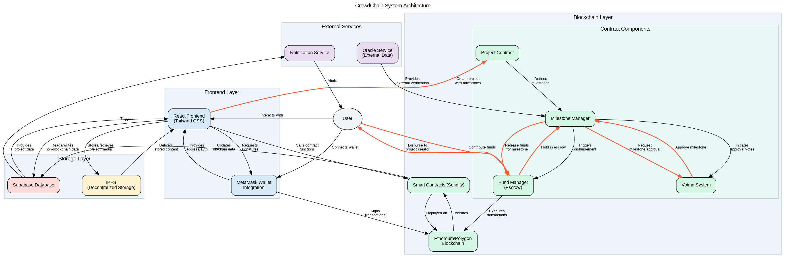

# CrowdChain

_Crowdfunding on the blockchain with milestone-based payouts_

---

## Table of Contents
1. [Project Overview](#project-overview)
2. [Architecture](#architecture)
3. [Quick Start](#quick-start)
4. [Smart Contracts](#smart-contracts)
5. [Environment Variables](#environment-variables)
6. [Scripts](#scripts)
7. [Testing](#testing)
8. [Deployment](#deployment)
9. [Contributing](#contributing)
10. [License](#license)

---

## Project Overview
CrowdChain is a decentralized crowdfunding platform that allows creators to raise funds transparently. It improves the typical model by introducing **milestone-based funding** – funds are released only when backers approve completed milestones. This increases accountability and reduces risk for supporters.

Technologies used:
* React + TailwindCSS front-end
* Hardhat / Solidity smart contracts
* Ethers.js for blockchain interaction
* Supabase for off-chain data storage & auth
* IPFS for media hosting

## Architecture


High-level components:
1. **Front-end** – React SPA served from Netlify / Vercel.
2. **Smart Contract** – Solidity contract deployed to an EVM chain (e.g. Polygon).
3. **Supabase** – Postgres DB + Auth and storage for images.
4. **IPFS** – Decentralized file storage for immutable assets.

See additional diagrams in the `docs/` folder.

## Quick Start
```bash
# 1. Install dependencies
npm install

# 2. Copy env template and fill values
cp .env.example .env

# 3. Start the dev servers
npm run start        # React front-end
npx hardhat node     # Local blockchain
npx hardhat run scripts/deploy.js --network localhost
```
Then open `http://localhost:3000`.

## Smart Contracts
Detailed documentation is available in [`docs/SMART_CONTRACT.md`](docs/SMART_CONTRACT.md).

Deploy on a testnet:
```bash
npx hardhat run scripts/deploy.js --network sepolia
```

Run contract tests:
```bash
npm run test
```

## Environment Variables
| Variable | Description |
|----------|-------------|
| `REACT_APP_SUPABASE_URL` | Supabase project URL |
| `REACT_APP_SUPABASE_ANON_KEY` | Supabase anon key |
| `REACT_APP_IPFS_PROJECT_ID` | IPFS project ID |
| `REACT_APP_IPFS_PROJECT_SECRET` | IPFS secret |

## Scripts
* `npm run start` – Start React in dev mode
* `npm run build` – Production build
* `npm run test` – Run jest / hardhat tests
* `npm run lint` – ESLint source

